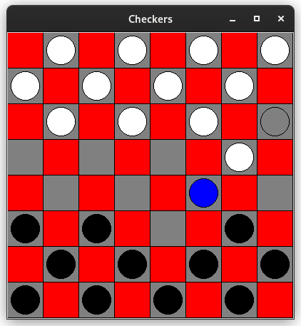

# Simple Checkers

## About
Simple Checkers ist eine einfache Checkers-Ausführung, die in Python geschrieben wurde. Es handelt sich um kein fertiges Spiel, sondern dient eher der beispielhaften Implementierung eines MiniMax-Algorithmus.

## Projektbeschreibung
Das Spiel besteht aus folgenden Hauptklassen:
- **Board:** Repräsentiert das Spielbrett und beinhaltet Funktionen zum Zeichnen des Bretts und der Spielsteine. Verwaltet Angaben zum Spielmodus sowie die Steine der Spieler. Mit executeMove() und changeTurn() sind auch die wesentlichen Funktionen bzgl. des Tätigens eines Spielzuges enthalten.
- **Stone:** Repräsentiert einen einzelnen Spielstein. Speichert z.B. die Position des Spielsteins, mögliche Züge und den Typ (normal oder König).
- **PathTree:** Ein PathTree speichert die möglichen Züge in einer Baumstruktur. Da in Checkers Mehrfachsprünge möglich sind, können sich in einer bestimmten Spielsituation für einen Stein verschieden lange Sprungmöglichkeiten ergeben.
- **Move:** Ein Move entspricht einem Zug. Im Gegensatz zum PathTree enthält ein Move keine Information über die "Zwischensprünge", d.h. es werden nur Informationen 
zur Endposition und eine Liste der übersprungenen Steine gespeichert. 
- **Brain:** Die Brain-Klasse enthält die eigentliche Spiellogik und zwar zum einen die rekursive Berechnungsfunktion eines PathTrees und zum anderen die Implementierung des MiniMax-Algorithmus, d.h. der eigentlichen KI. Außerdem enthält Brain eine Evaluierungsfunktion, welche die Güte des Spielzugs bewertet. Dies ist für die Berechnung und Auswahl eines optimalen Spielzuges entscheidend.

Der grundsätzliche Spielablauf sieht folgendermaßen aus:
- Für jeden Stein des an der Reihe befindlichen Spielers wird ein PathTree erstellt, d.h. die möglichen Züge berechnet. Ein menschlicher Spieler klickt dann auf einen Stein und führt den gewünschten Zug aus (Achtung: Schlagzwang wird nicht durchgesetzt, da dies zum Testen besser war.)
- Die KI hingegen startet nun eine Rekursion und ruft abwechselnd die max() und min() Funktion auf.
- Die max()-Funktion wählt dabei den für die KI besten Zug in Abhängigkeit von der unten erläuterten Bewertungsfunktion aus, simuliert diesen Spielzug und ruft danach die min()-Funktion auf.
- Die min()-Funktion wählt schließlich den für den Gegner schlechtesten Zug aus, simuliert diesen und ruft wiederum die max()-Funktion auf usw...
- Daraus ergibt sich ein beliebig großer Baum an Spielzügen (Stop-Bedingung kein Zug mehr möglich oder vorgegebene Tiefe erreicht), wobei theoretisch alle Spielzüge vorberechnet werden könnten. Die Spielzugtiefe ist mit 4 voreingestellt, was auf dem Testrechner bereits einige Berechnungszeit beanspruchte. Die Spielzugtiefe kann in der settings.py-Datei eingestellt werden (MINIMAX_DEPTH).

## Evaluation eines Spielzugs
Die Güte der KI steht und fällt mit der Bewertung der einzelnen Züge. In der vorliegenden Checkers-Implementierung wird ein Zug nach folgenden Gesichtspunkten bewertet:
- Sprung in eine gefährliche Position: - 5000 (d.h. Stein könnte vom Gegner geschlagen werden)
- Anzahl der übersprungenen Steine: + Anzahl * 1000
- Sprung ins Zentrum: + 100
- Sprung, damit Stein zum König wird: + 200
- Ein Zufallsparameter, um eine zufällige Auswahl aus gleichwertigen Sprüngen zu gewährleisten (Ansonsten kommt es zu vorhersehbaren Sprungmustern der KI!)

## Kritische Würdigung
Der KI mangelt es an spielzugübergreifenden Strategien, was sich gerade gegen Ende des Spiels zeigt, wobei sie die Steine scheinbar willkürlich hin und her schiebt. Da ich das Spiel aber selbst nicht wirklich spielen kann, bin ich mit dem Ergebnis halbwegs zufrieden ;-). Eventuell könnte man eine Verbesserung unter Anpassung der vorgegebenen Punkte innerhalb der Evaluationsfunktion erreichen.
